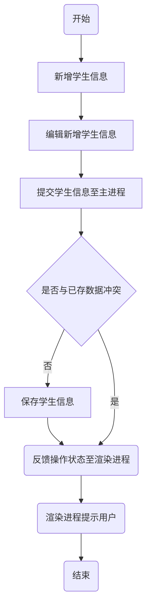
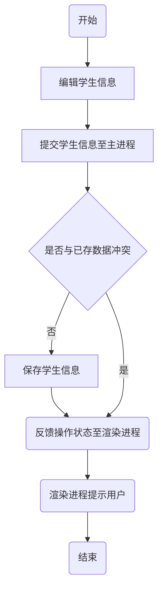
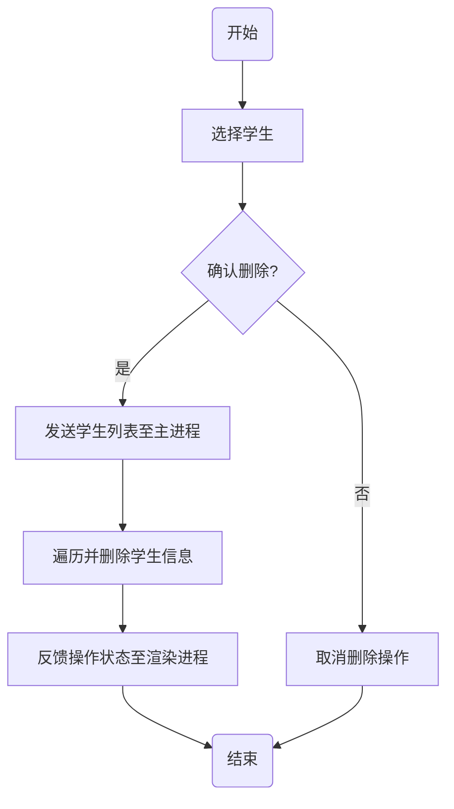
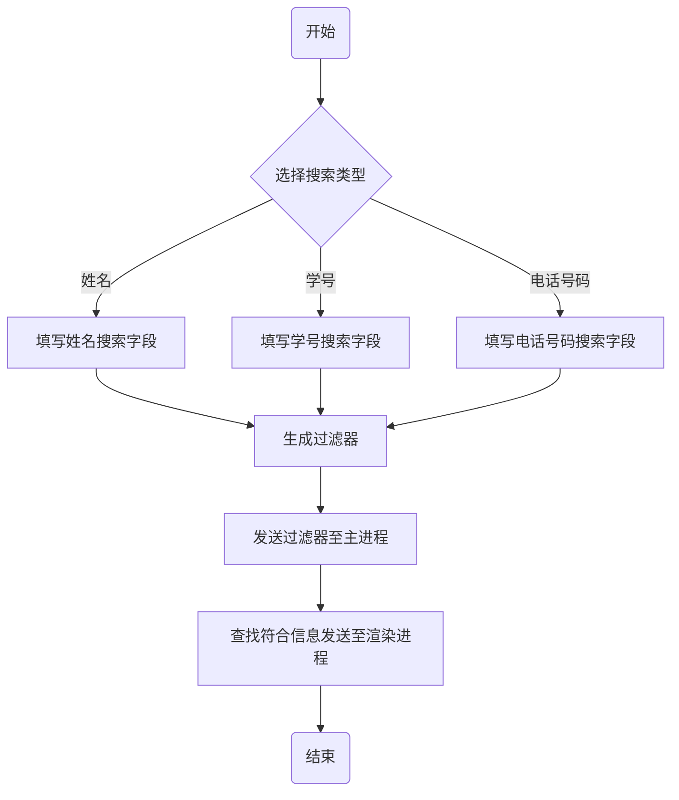
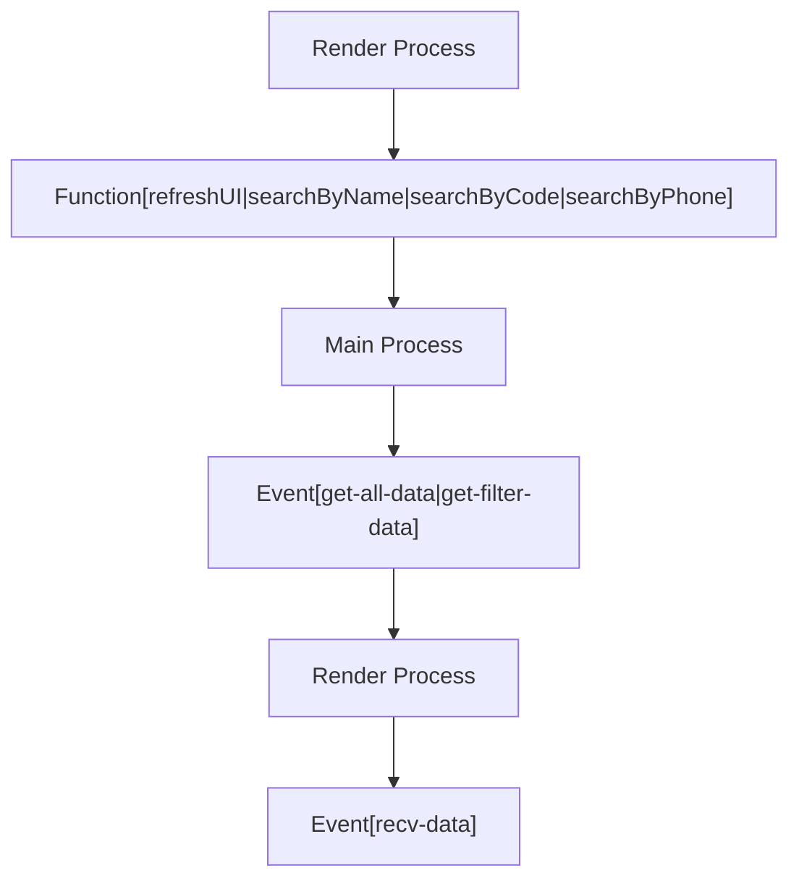
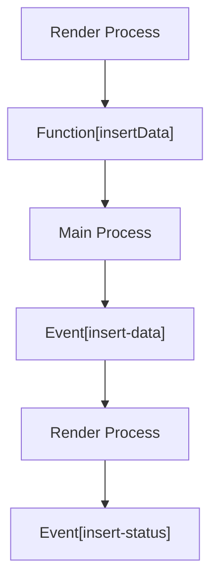
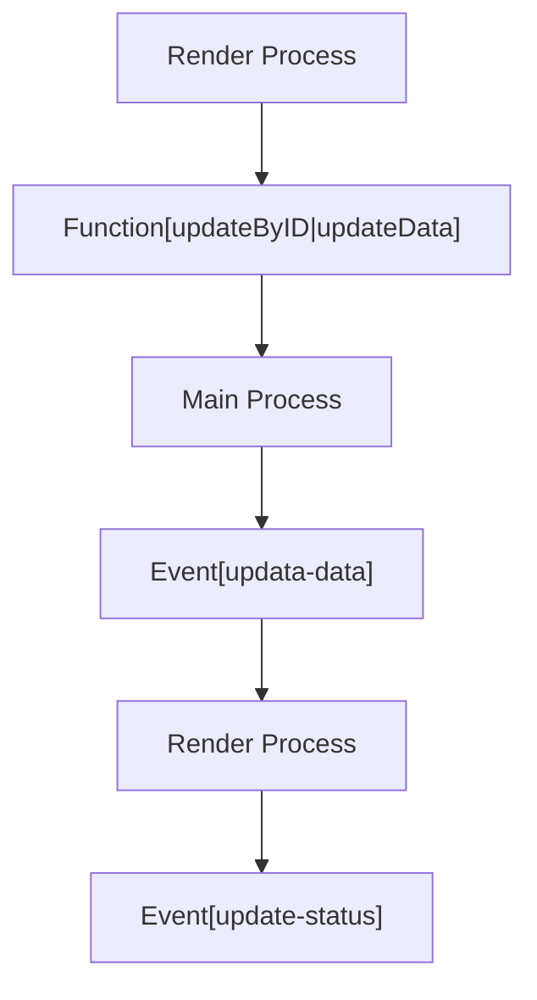
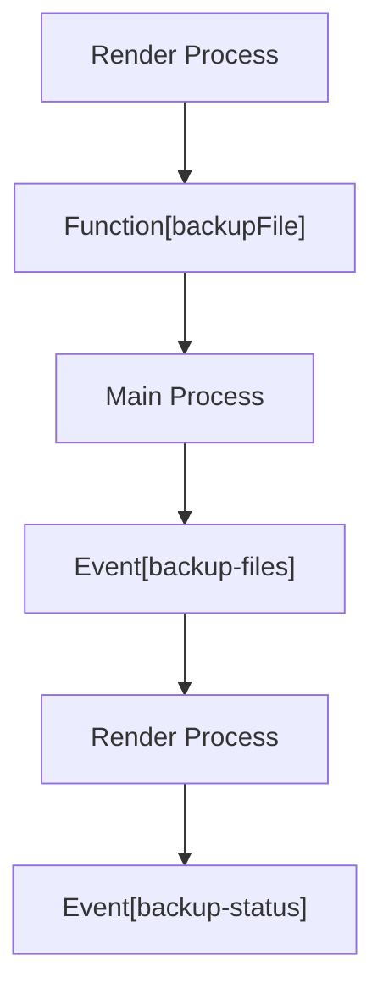
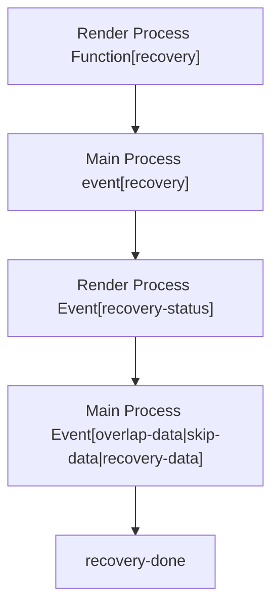

### 新增学生信息

```mermaid
    graph TD
    start(开始) --> new[新增学生信息]
    new --> edit[编辑新增学生信息]
    edit --> submit[提交学生信息至主进程]
    submit --> judge{是否与已存数据冲突}
    judge -- 否 --> save[保存学生信息]
    save --> response(反馈操作状态至渲染进程)
    judge -- 是 --> response
    response --> tips(渲染进程提示用户)
    tips --> final(结束)
```

### 编辑学生流程图

```mermaid
graph TD
	start(开始) --> edit[编辑学生信息]
	edit --> submit[提交学生信息至主进程]
    submit --> judge{是否与已存数据冲突}
    judge -- 否 --> save[保存学生信息]
    save --> response(反馈操作状态至渲染进程)
    judge -- 是 --> response
    response --> tips(渲染进程提示用户)
    tips --> final(结束)
```

### 删除学生信息流程图

```mermaid
graph TD
start(开始) --> select[选择学生]
select --> ensure{确认删除?}
ensure -- 是 --> submit[发送学生列表至主进程]
ensure -- 否 --> cancel[取消删除操作]
submit --> save[遍历并删除学生信息]
save --> response[反馈操作状态至渲染进程]
response --> END(结束)
cancel --> END
```

### 查找学生信息

```mermaid
graph TD
start(开始) --> select{选择搜索类型}
select -- 姓名 --> name[填写姓名搜索字段]
select -- 学号 --> code[填写学号搜索字段]
select -- 电话号码 --> phone[填写电话号码搜索字段]
name --> generate[生成过滤器]
code --> generate
phone --> generate
generate --> submit[发送过滤器至主进程]
submit --> query[查找符合信息发送至渲染进程]
query --> END(结束)
```

### 获取数据请求数据路径

```mermaid
graph TD
start["Render Process"] --> r_func["Function[refreshUI|searchByName|searchByCode|searchByPhone]"]
r_func --> main["Main Process"]
main --> m_event["Event[get-all-data|get-filter-data]"]
m_event --> render["Render Process"]
render --> r_event["Event[recv-data]"]
```

### 新增数据请求数据路径

```mermaid
graph TD
start["Render Process"] --> r_func["Function[insertData]"]
r_func --> main["Main Process"]
main --> m_event["Event[insert-data]"]
m_event --> render["Render Process"]
render --> r_event["Event[insert-status]"]
```

### 更新数据请求数据路径

```mermaid
graph TD
start["Render Process"] --> r_func["Function[updateByID|updateData]"]
r_func --> main["Main Process"]
main --> m_event["Event[updata-data]"]
m_event --> render["Render Process"]
render --> r_event["Event[update-status]"]
```

### 备份请求数据路径

```mermaid
graph TD
start["Render Process"] --> r_func["Function[backupFile]"]
r_func --> main["Main Process"]
main --> m_event["Event[backup-files]"]
m_event --> render["Render Process"]
render --> r_event["Event[backup-status]"]
```

### 恢复请求数据路径

```mermaid
graph TD
start["Render Process Function[recovery]"] --> main_1["Main Process event[recovery]"]
main_1 --> render_e1["Render Process Event[recovery-status]"]
render_e1 --> main_e1["Main Process Event[overlap-data|skip-data|recovery-data]"]
main_e1 --> render_e2[recovery-done]
```

